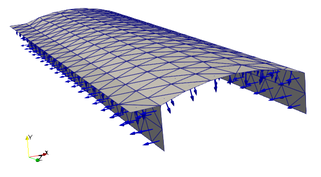
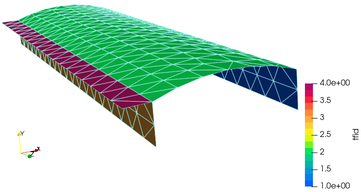

[](http://www.repostatus.org/#active)
[](https://github.com/PetrKryslUCSD/ShellStructureTopo.jl/actions)

# ShellStructureTopo.jl

The purpose of this package is to detect topological classification of a
triangular surface mesh. For instance, the orientation of the triangles can be
unified across the surface mesh. The topological faces can be identified.




## Usage

### When used with MeshCore

Given an incidence relation, `t2v` (triangles to vertices),
we can produce an oriented surface: 
```
orientedt2v, orientable = orient_surface_mesh(t2v)
```
And, when the triangles tile a single surface, we can check that all the triangles have been classified on surface 1:
```
@test length(unique(attribute(orientedt2v.left, "surfid"))) == 1
```


Given an incidence relation, `t2v` (triangles to vertices),
we can classify the triangles on oriented surfaces: 
```
t2v = make_topo_faces(t2v)
```
In this instance, we would expect the triangles to represent four distinct topological surfaces. We can check the `"tfid"` attribute of the incidence relation `t2v`:
```
@test length(unique(attribute(t2v.left, "tfid"))) == 4
```

The topological classification may be visualized with
```
t2v = make_topo_faces(t2v)
vtkwrite("mt008-classified", t2v, [(name = "tfid", )])
```
The topological surfaces will be labeled with the attribute `"tfid"`.

### When used with FinEtools

The boundary triangles of the triangulated surface of a solid part may be classified into topological faces with:
```
fens, bfes = make_topo_faces(fens, bfes)
```
Here `bfes.label` records the numbers of the topological surfaces.

The classification may be visualized with
```
VTK.vtkexportmesh("mt013.vtk", connasarray(bfes), fens.xyz, VTK.T3; scalars=[("topological_face", bfes.label)]);
```

The library may be also used to create partition of the topological faces into individual patches.  
```
surfids, partitionids = create_partitions(fens, fes, 50)
```

The classification into topological faces and the partitioning may then be viewed with
```
VTK.vtkexportmesh("mt016_part.vtk", connasarray(fes), fens.xyz, VTK.T3; scalars=[("topological_face", surfids), ("partitioning", partitionids)]);
```

## Reference manual

- `orient_surface_mesh`
```
    orient_surface_mesh(t2v)

Orient surface mesh.

Return
- `orientedt2v`: oriented incidence relation
- `orientable`: Can the surface mesh be oriented? Bool flag.
    This would be false for a Mobius strip, for instance.

This is a purely topological operation. Creases in the surface are not
recognized as edges. The operation proceeds by flooding the surface across
manifold edges, stopping at sheet or non-manifold edges.

The incidence relation `orientedt2v` includes an attribute for each triangle
that provides the surface id to which the triangle belongs
(`orientedt2v.left.attributes["surfid"]`).
```

- `make_topo_faces`
```
    make_topo_faces(t2v, crease_ang = 30/180*pi)

Make topological faces.

Topological faces are assumed to be separated by either creases or non-manifold
edges (junctions). So the boundary of topological faces consists of sheet edges,
non-manifold edges, or crease edges.

Returns
- `t2v`: the attribute `tfid` lists the numbers of the topological faces.
```

```
    make_topo_faces(fens::FENodeSet, fes::E, crease_ang = 30/180*pi) where {E<:AbstractFESet} 

Make topological faces.

Topological faces are assumed to be separated by either creases or non-manifold
edges (junctions). So the boundary of topological faces consists of sheet edges,
non-manifold edges, or crease edges.

Returns
- `fes`: the `fes.label` field lists the numbers of the topological faces.
```

- `create_partitions`
```
    create_partitions(fens, fes, elem_per_partition = 50; 
      crease_ang = 30/180*pi, 
      cluster_max_normal_deviation = 2 * crease_ang,
      balancefraction = 0.6, randomize = false)

Create partitions of the triangulated boundary into clusters.

# Input

- `fens`, `fes` = finite element mesh,
- `elem_per_partition` = desired number of elements per partition,
- `crease_ang` = crease angle to determine boundaries between topological faces,
- `cluster_max_normal_deviation` = maximum deviation of the normal within the
  cluster.
- `balancefraction` = fraction of the cluster size by which the cluster can
  deviate from the average size so that can be considered balanced.

# Output

- `surfids` = array of surface identifiers, one for each boundary facet
- `partitionids` = array of partition identifiers (i.e. cluster identifiers),
  one for each boundary facet
- `surface_elem_per_partition` = dictionary of cluster sizes, indexed by the
  surface id
```

## News

- 12/05/2024: Make the randomization optional.
- 07/06/2024: Improve estimation of number of partitions.
- 07/06/2024: Update for FinEtools 8.
